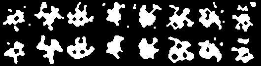
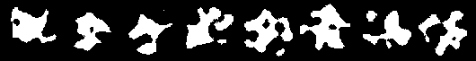

# VAE_NSF
A simple and basic framework of VAE for NEU NSF project.


## Preliminary Result
(We believe an elaborate fine-tuning for the args would provide better results)



First, we reconstruct images using pretrained vanilla VAE models. Top: original images; Bottom:  corresponding reconstructed images.




Next, we randomly sample latent features following N(0,1), and decode the latent feature, as shown above.

Here is the [[training log]](https://northeastern-my.sharepoint.com/:u:/g/personal/ma_xu1_northeastern_edu/EcLI3zEbJkpFjh4SK5ZZpTUB8Wk4Wm8gbzZT_P_xd7z7AQ?e=eujEdu) 
and [[pretrained model]](https://northeastern-my.sharepoint.com/:u:/g/personal/ma_xu1_northeastern_edu/EcLI3zEbJkpFjh4SK5ZZpTUB8Wk4Wm8gbzZT_P_xd7z7AQ?e=n51uFM).

Download limits to NEU user.

## Usage

### Training
```Bash
python3 main.py --traindir {Path-to-traindir} --testdir {Path-to-traindir}
# change the parameters accordingly if necessary
# example
python3 main.py --traindir /home/UNT/jg0737/Desktop/NSFdata/train_data --testdir /home/UNT/jg0737/Desktop/NSFdata/test_data
```
After training, we will automatically test (reconstruct and sample), the figures will be saved in "./checkpoints/VanillaVAE-128" folder.

### Testing
```Bash
python3 main.py --evaluate --resume {Path-to-saved-checkpoint}
# change the parameters accordingly if necessary
# example
# python3 main.py --evaluate --resume /home/UNT/jg0737/Desktop/VAE_NSF/checkpoints/VanillaVAE-128/checkpoint_best.pth 
```
This will test the model by sampling and reconstructing.
